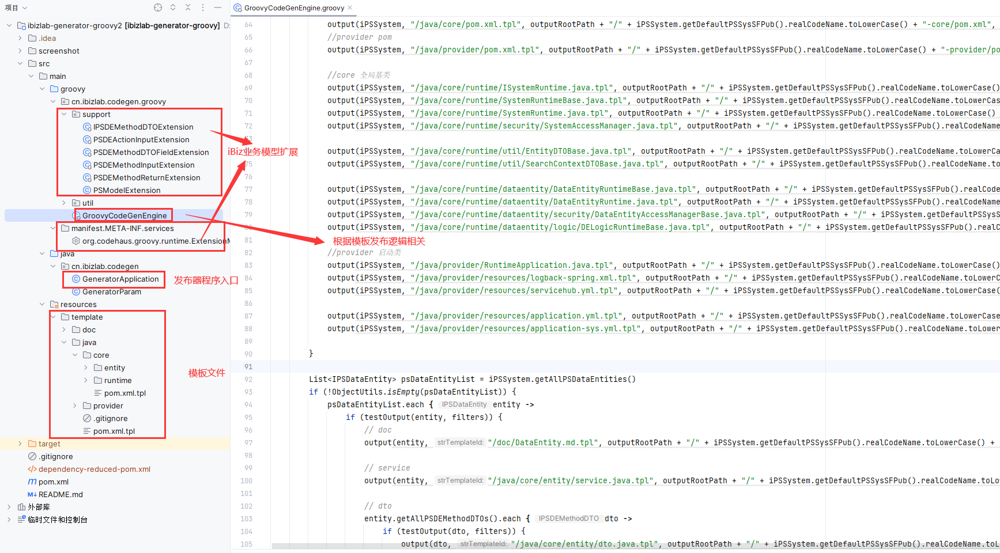
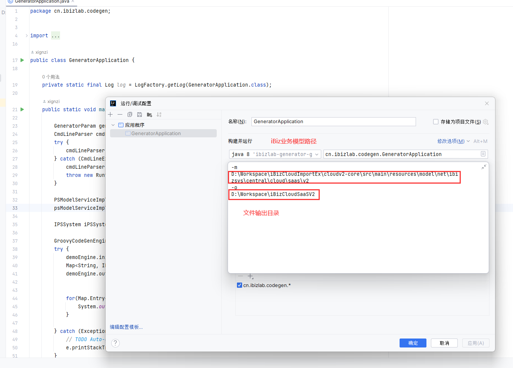
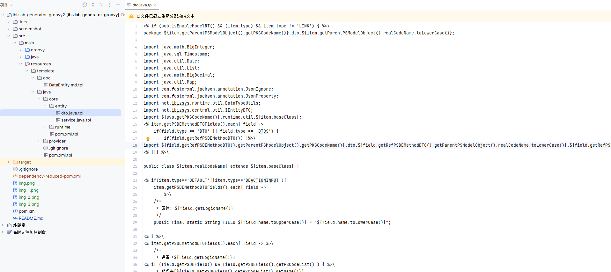
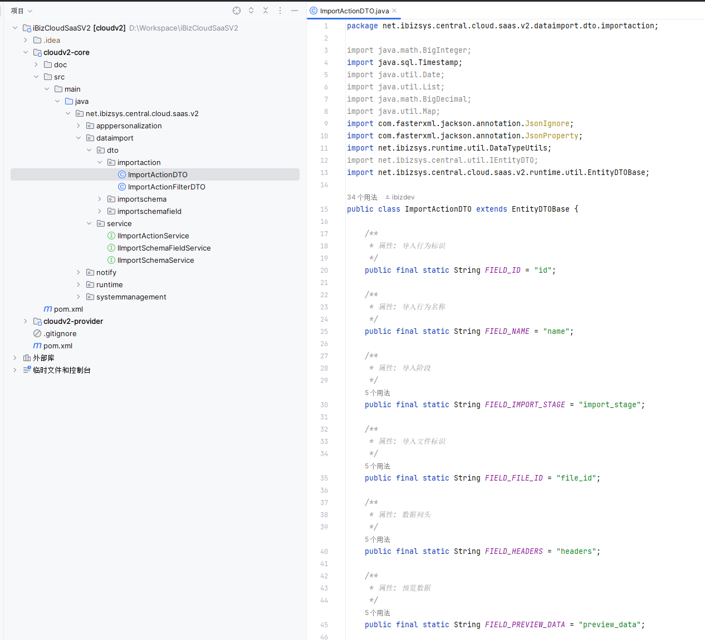
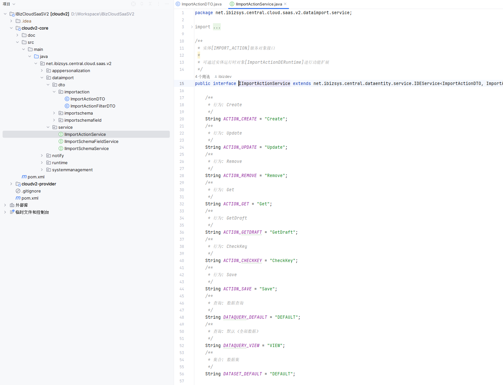
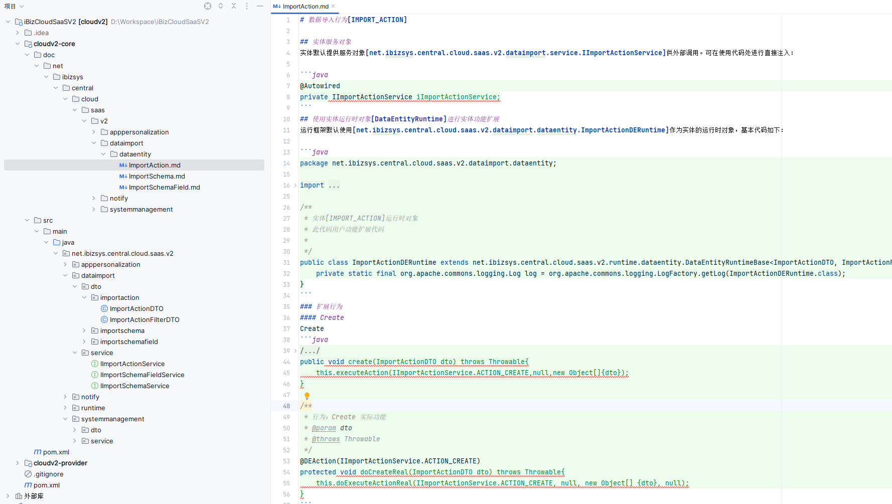
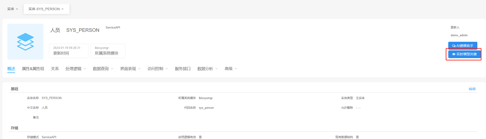
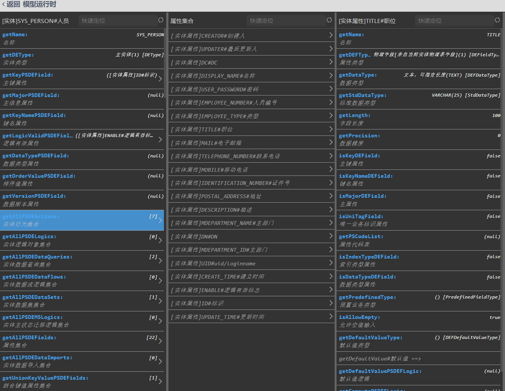

# 基于iBiz业务模型发布器

[iBiz软件工厂](http://www.ibizsys.cn/ungroup/portal)

[iBiz模型文档](http://www.ibizsys.cn/ungroup/portal)

# 目标
基于iBiz提供的标准业务模型，结合客户自身技术积累，打造最适合客户需求发布模板，实现高效自动化能力。
拥有代码智能、场景丰富、创造价值、广泛应用等多重产品优势，可实现“帮你想、帮你写、帮你改”的场景应用形态。
提升编码效率，释放“十倍”软件生产力。

发布器不光是代码实现相关，可以任何文件形式发布，如：

* 项目代码
* 项目文档
* 项目脚本
* 项目配置
* 项目脚手架

# 特性

* iBiz业务模型驱动，快速获取业务模型相关配置
* 支持多种文件类型发布，如：java,xml,sql,html,js,css,json,python,properties等
* 发布文件可由客户自由组织，贴合客户技术累积
* 基于`Groovy`模板语言，支持客户自身扩展iBiz业务模型
* 易于做二次开发,发布器本身就是`java`源代码,源代码核心十分精简,并且鼓励您修改代码,也可以作为任何语言的代码发布器

# 发布器结构



1. GroovyCodeGenEngine 主要为客户组织需要发布内容，以及发布组织目录相关代码
2. support包中主要是iBiz业务模型扩展支持
3. template目录为GroovyCodeGenEngine中发布提供得模板支持目录，可自由组织
4. GeneratorApplication 为发布程序入口

# 发布器运行



指定iBiz业务模型文件目录、输出目录
### 模板结构

### 发布成果




# 发布器讲解

发布代码主要依赖方法
```
	/**
	 * 
	 * @param iPSObject         模型对象，在对应tpl模板中对应item对象
	 * @param strTemplateId     对应tpl模板文件路径   
	 * @param strDestFilePath   对应模板生成的文件
	 * @param fileMap
	 * @param bIgnoreException
	 * @return
	 * @throws Exception
	 */
GroovyCodeGenEngine.output(IPSModelObject iPSObject, String strTemplateId, String strDestFilePath, Map<String, IPSModelObject> fileMap, boolean bIgnoreException)
```
以上述运行生成DTO对照
`template/java/core/entity/dto.java.tpl`
```java
output(dto, "/java/core/entity/dto.java.tpl", outputRootPath + "/" + iPSSystem.getDefaultPSSysSFPub().realCodeName.toLowerCase() + "-core/src/main/java/" + entity.getPKGCodeName().replace(".", "/") + "/dto/" + entity.realCodeName.toLowerCase() + "/" + dto.realCodeName + ".java", fileMap, bIgnoreException)
```

### 模板编写
在模板tpl采用`Groovy`模板语法，文件中默认可使用的对象包含：
* `item` 当前iBiz业务模型
* `ctx` ICodeGenEngineContext 对象，可扩展通用方法提供给模板中使用
* `sys` 对应iBiz系统模型

简单的实体DTO模板写法
```
public class ${item.realCodeName} extends ${item.baseClass} {

<% if(item.type=='DEFAULT'||item.type=='DEACTIONINPUT'){
    item.getPSDEMethodDTOFields().each{ field ->  %>\
    /**
     * 属性: ${field.getLogicName()}
     */
    private ${field.javaType} ${field.getCodeName()};

<% }} %>\
}
```


#### iBiz模型扩展

使用`Groovy`扩展机制，针对特定的iBiz业务模型进行扩展

例如像针对iBiz业务模型中的属性模型，获取对应python类型
* 建立对应属性模型处理 
```java
package cn.ibizlab.codegen.groovy.support;

import cn.ibizlab.codegen.groovy.util.PythonTypeUtil;
import net.ibizsys.model.dataentity.defield.IPSDEField;
import net.ibizsys.model.dataentity.service.IPSDEMethodDTOField;

/**
 *  实体字段扩展 python
 *  
 * @author 01377407
 * @date 2020/11/12 16:12
 * @version 1.0.0
 */
public class PSDEFieldExtension {

    static String getPythonType(IPSDEField iPSDEField) {
        return PythonTypeUtil.getPythonType(iPSDEField.getStdDataType());
    }

}
```
* 添加mainfest配置extensionClasses
```
moduleName=ibizlab-generator-groovy
moduleVersion=1.0
extensionClasses=cn.ibizlab.codegen.groovy.support.PSDEFieldExtension
```
* 模板中，针对IPSDEField模型，可以使用getPythonType()方法
```
python属性类型：${item.getPythonType()}
```

# iBiz模型说明
[iBiz模型文档](http://www.ibizsys.cn/ungroup/portal)

独立加载iBiz模型：
```
    <dependency>
	    <groupId>net.ibizsys.plugin</groupId>
	    <artifactId>ibiz-model</artifactId>
		<version>8.1.0.377</version>
    </dependency>
```
```java
    PSModelServiceImpl psModelServiceImpl = new PSModelServiceImpl();
    psModelServiceImpl.setPSModelFolderPath("../iBiz模型目录");
    //加载iBiz业务模型
    IPSSystem iPSSystem = psModelServiceImpl.getPSSystem();
```


在[iBiz软件工厂](http://www.ibizsys.cn/ungroup/portal)中点击“实时模型对象”，也可以方便查看模型配置说明，以及获取模型配置方法：




# 常用模型

| iBiz模型  | 模型对象                                           |
|---------|------------------------------------------------|
| 系统      | net.ibizsys.model.IPSSystem|
| 数据库体系   | net.ibizsys.model.database.IPSSysDBScheme|
| 数据库表    | net.ibizsys.model.database.IPSSysDBTable|
| 实体      | net.ibizsys.model.dataentity.IPSDataEntity|
| 实体关系    | net.ibizsys.model.dataentity.der.IPSDERBase|
| 实体属性    | net.ibizsys.model.dataentity.defield.IPSDEField|
| 实体行为    | net.ibizsys.model.dataentity.action.IPSDEAction|
| 实体处理逻辑  | net.ibizsys.model.dataentity.logic.IPSDELogic|
| 实体数据查询  | net.ibizsys.model.dataentity.ds.IPSDEDataQuery|
| 实体数据集合  | net.ibizsys.model.dataentity.ds.IPSDEDataSet|
| 服务接口    | net.ibizsys.model.service.IPSSysServiceAPI|
| 服务实体    | net.ibizsys.model.dataentity.service.IPSDEServiceAPI|
| 服务实体DTO | net.ibizsys.model.dataentity.service.IPSDEMethodDTO|
| 服务实体方法  | net.ibizsys.model.dataentity.service.IPSDEServiceAPIMethod|
| 应用视图    | net.ibizsys.model.app.view.IPSAppView|
| 菜单      | net.ibizsys.model.app.appmenu.IPSAppMenuModel|
| 表格      | net.ibizsys.model.control.grid.IPSDEGrid|
| 表单      | net.ibizsys.model.control.form.IPSDEForm|
| ...     ||
| ...     ||
